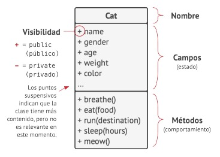
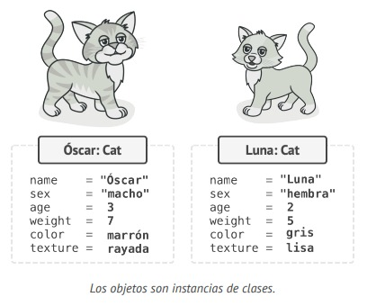

## `Programación orientada a objetos`

La programación orientada a objetos (POO) es un paradigma basado en el concepto de 
envolver bloques de información y su comportamiento relacionado, en lotes especiales llamados objetos, que se construyen a partir de un grupo de "planos" definidos por un programador, que se denominan clases.

- Esto es un diagrama de clases en UML. Encontrarás muchos diagramas como éste en el libro. Los nombres de las cosas en los diagramas están en inglés, como lo estarían en un código real. Sin embargo, los comentarios y las notas pueden estar en español.

Una clase es como un plano que define la estructura de los objetos, que son instancias concretas de esa clase.

### *Jerarquias de clase*

 Se pueden poner Perro y Gato que extiendan de una misma clase llamada Animal, que tiene los metodos de (Respirar, caminar, dormir, comer, etc..) que son compartidos por los animales.

 

